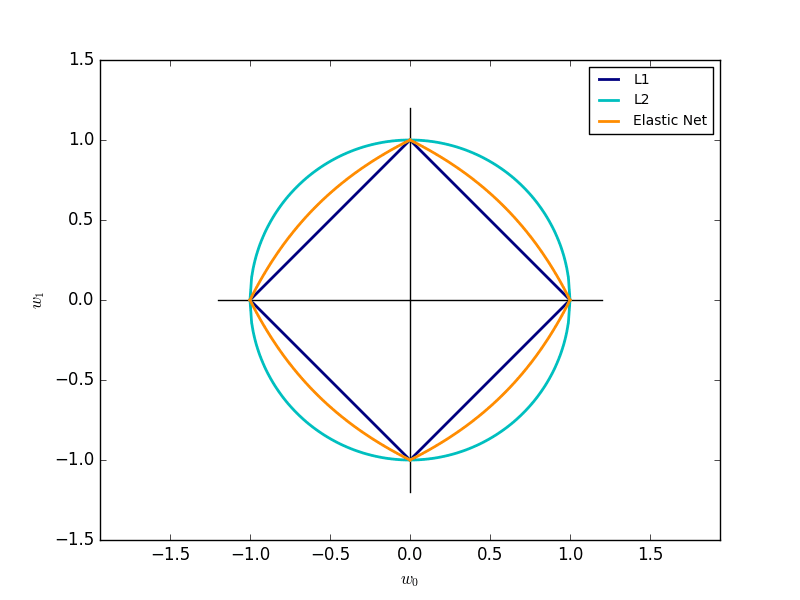

```{r, comment=NA}
library(data.table)
library(glmnet)
library(ggplot2)
library(plotly)
```

http://enhancedatascience.com/2017/07/04/machine-learning-explained-regularization/

Welcome to this new post of Machine Learning Explained.After dealing with overfitting, today we will study a way to correct overfitting with regularization. Regularization adds a penalty on the different parameters of the model to reduce the freedom of the model. Hence, the model will be less likely to fit the noise of the training data and will improve the generalization abilities of the model. In this post, we will study and compare:

- The L1 regularization (also called Lasso)

- The L2 regularization (also called Ridge)

- The L1/L2 regularization (also called Elastic net)

You can find the R code for regularization at the end of the post.

## L1 Regularization (Lasso penalisation)

The L1 regularization adds a penalty equal to the sum of the absolute value of the coefficients. 

    Error[L1] = Error + sum(|B[i]|, i = 0:N)
 
where the B[i] are the parameters.

The L1 regularization will shrink some parameters to zero. Hence some variables will not play any role in the model, L1 regression can be seen as a way to select features in a model. Let's see this with an example!

We want to predict the prices of houses from House Sales in King County, USA dataset on Kaggle. We will train the data on 0.5% of the dataset, we are taking such a small dataset to ensure that they will be overfitting. The test will be done on the other 99.5% of the data.

We will use the glmnet packages to set a penalization and to test several lambda values. As lambda grows bigger, more coefficient will be cut. Below is the evolution of the value of the different coefficients while lambda is growing.

```{r, comment=NA}
set.seed(123)

# reading data
housingData <- fread('kc_house_data.csv')

# Removing non numeric var
housingData[ , floors := as.numeric(floors)][ , c('zipcode', 'lat', 'long', 'id', 'date', 'sqft_basement') := NULL]

# Splitting data
indexTrain <- sample.int(nrow(housingData), nrow(housingData)*0.005)

# no Reg
lmNoReg <- lm(price ~ ., housingData[indexTrain])
summary(lmNoReg)
pred_no_reg <- predict(lmNoReg, housingData[-indexTrain])
 
sqrt(mean((pred_no_reg - housingData[-indexTrain]$price)^2))

plotCoeffEvolution <- function(penalizedGlm, type = 'L1') {
 lambda <- penalizedGlm$lambda
 coeff <- as.matrix(penalizedGlm$beta)
 rowName <- rownames(coeff)
 coeff <- data.table(coeff)
 coeff[ , name := rowName]
 coeff <- melt(coeff, id.vars = 'name')
 coeff[ , variable := rep(lambda, each = length(unique(name)))]
 ggplot(coeff, aes(x = variable, y = value, color = name)) +
   geom_line() +
   xlab(paste0(type,' regularisation')) +
   ylab('Value of coefficient') +
   scale_x_log10()
}
 
# Different L1 regularisation
fit <- glmnet(as.matrix(housingData[indexTrain, -c('price'), with = FALSE]),
              as.matrix(housingData[indexTrain]$price), family = "gaussian", alpha = 1)
 
pred_L1_reg <- data.table(predict(fit, as.matrix(housingData[-indexTrain, -c('price'), with = FALSE])))
RMSE_L1 <- sqrt(apply(pred_L1_reg[ , (.SD - housingData[-indexTrain]$price)^2, .SD = 1:ncol(pred_L1_reg)], 2, mean))
DF_plot <- data.frame(lambda = fit$lambda, rmse = RMSE_L1)

plotCoeffEvolution(fit, 'L1')
```

As expected, coefficients are cut one by one until no variables remain. Let's see how the test error is evolving:

```{r, comment=NA}
ggplot(DF_plot, aes(x = lambda, y = rmse)) +
  geom_line() + 
  ggtitle("Evolution of test error vs lambda value") +
  scale_x_log10()
```

At the beginning, cutting coefficient reduces the overfitting and the generalization abilities of the model. Hence, the test error is decreasing. However, as we are cutting more and more coefficient, the test error start increasing. The model is not able to learn complex pattern with so few variables.

## L2 Regularization (Ridge penalisation)

The L2 regularization adds a penalty equal to the sum of the squared value of the coefficients.

    Error[L2] = Error + sum(lambda*B[i]^2, i = 0:N)

The L2 regularization will force the parameters to be relatively small, the bigger the penalization, the smaller (and the more robust) the coefficients are.

```{r, comment=NA}
# L2 regularisation
fit <- glmnet(as.matrix(housingData[indexTrain, -c('price'), with = FALSE]),
              as.matrix(housingData[indexTrain]$price), family = "gaussian", alpha = 0)
 
pred_L2_reg <- data.table(predict(fit, as.matrix(housingData[-indexTrain, -c('price'), with = FALSE])))
RMSE_L2 <- sqrt(apply(pred_L2_reg[ , (.SD - housingData[-indexTrain]$price)^2, .SD = 1:ncol(pred_L2_reg)], 2, mean))
DF_plot <- data.frame(lambda = fit$lambda, rmse = RMSE_L2)

plotCoeffEvolution(fit, 'L2')
```

When we compare this plot to the L1 regularization plot, we notice that the coefficients decrease progressively and are not cut to zero. They slowly decrease to zero. That is the behavior we expected. Let's see how the test error evolves:

```{r, comment=NA}
ggplot(DF_plot, aes(x = lambda, y = rmse)) +
  geom_line() +
  ggtitle("Evolution of test error vs lambda value") +
  scale_x_log10()
```

On this case, the L2 regularization is more efficient than the L1 regularization with an error below 240,000.

## Elastic-net

Elastic-net is a mix of both L1 and L2 regularizations. A penalty is applied to the sum of the absolute values and to the sum of the squared values:

    Error[L1L2] = Error + lambda((1 - alpha)*sum(B[i]^2, i = 0:N) + alpha*sum(|B[i]|, i = 0:N))

Lambda is a shared penalization parameter while alpha sets the ratio between L1 and L2 regularization in the Elastic Net Regularization. Hence, we expect a hybrid behavior between L1 and L2 regularization.Elastic coefficients evolution

```{r, comment=NA}
# Different L1L2 regularisation
fit <- glmnet(as.matrix(housingData[indexTrain, -c('price'), with = FALSE]), as.matrix(housingData[indexTrain]$price), family = "gaussian", alpha = 0.03)
 
pred_L1L2_reg <- data.table(predict(fit, as.matrix(housingData[-indexTrain, -c('price'), with = FALSE])))
RMSE_L1L2 <- sqrt(apply(pred_L1L2_reg[ , (.SD - housingData[-indexTrain]$price)^2, .SD = 1:ncol(pred_L1L2_reg)], 2, mean))
DF_plot <- data.frame(lambda = fit$lambda, rmse = RMSE_L1L2)

plotCoeffEvolution(fit, 'Elastic') 
```

And that's happening: Though coefficients are cut, the cut is less abrupt than the cut with lasso penalization alone. The Elastic Net error does not seem to improve the L2 our previous models.

```{r, comment=NA}
ggplot(DF_plot, aes(x = lambda, y = rmse)) +
  geom_line() +
  ggtitle("Evolution of test error vs lambda value") +
  scale_x_log10()
``` 

## A geometric perspective on regularization

The Lasso, Ridge and Elastic-net regression can also be viewed as a constraint added to the optimization process.

The Lasso error minimization can be rewritten:

    arg(min[B[i](MSE)) given that sum(|B[i]|) < t

And the ridge error minimization can be rewritten:

    arg(min[B[i](MSE)) given that sum(B[i]^2) < t

When written in this way, it's clear that Lasso restricts the coefficients to a square shape (or an L1 sphere) which diagonals are equal to 2t. The ridge error restricts the coefficients to a circle (or an L2 sphere) of radius t. This appears clearly in the picture above (from scikit-learn):



That's it, you know how regularization works! Here it was specifically used for linear regression but regularization can be used with any parametric algorithm (such as neural net).

If you liked this post, you can subscribe to the newsletter and get access to all our news on data science and machine learning.
